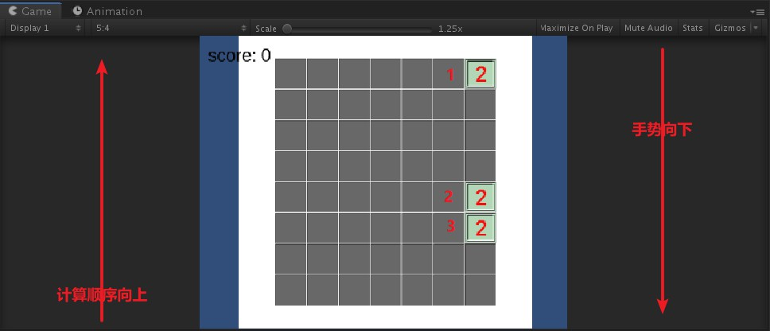

## 前言
 在本节中，笔者会给出一个建立于unity 2D template的小2048游戏《My 2048》（下称本游戏）的大致框架，以供读者参考。
## 场景
 如图所示，本游戏只有一个场景。

 场景中的游戏对象树如下：
-Main Camera （主摄影机）
-Directional Light （方向光源）
-cube (预制体)
--▼Board (7*8)
----▼Sprite （精灵）
--------map (地图精灵)
--------plane (背景平面精灵)
----▼GameCtl （游戏控制器）
--------board (挂载棋盘)
--------sign (挂载手势判断脚本)
--------merge (挂载合并器脚本)
--------procedure (挂载流程控制器)
--------move(挂载移动脚本)
--------event (挂载事件处理器)
----▼Audio （声效）
--------oncreate
--------onmerge
----▼UI （交互界面）
--------▼Canvas
------------TextMeshPro Text
------------score
## 描述
 我们假设2048游戏跟下棋一样，玩家每做一个手势程序都进行一轮计算，算出棋盘上所有方块下一步的位置（一步生成的棋盘为一个状态）以及分数后再进行移动。也就是，将方块的位置分为物理位置和逻辑位置，逻辑位置在方块移动之前就已经计算好。
 在计算逻辑位置的过程中，存在一个计算顺序的方向问题。由于2048方块是先接触先合并的，所以逻辑位置的计算顺序方向应该与手势的方向相反，如图，我们首先会计算方块3的位置，之后再计算方块2的位置，最后计算方块1的位置：

 整个游戏的流程，根据场景中的游戏对象可以描述为：
 Sprite作为游戏的背景出现。
 UI记录玩家得分。
 GameCtl通过克隆预制体生成新的方块，通过识别玩家鼠标的移动，移动、升级、销毁方块（升级和销毁可以看做合并过程）并且计分。同时GameCtl也会在方块发生升级和生成新方块时调用Audio演奏音效。
## 预制体cube与girdObject.cs
 虽然作为预制件存在（坦白说将其作为预制件只是因为觉得会被大量复制，这实际上是一个不必要的操作），但cube不应被移出场景，因为它有一个引用用到了场景中的游戏对象（event）。当然，也可以在生成时用脚本自动指定其引用。
 Cube的设置如图所示：

 可以看到，cube上只搭载了两个组件（除去Transform）Sprite Renderer（精灵渲染器）和Script（脚本）。Cube搭载的脚本即为girdObject类（girdObject.cs），它有九个字段，如下：
```ruby
    public int bonus=2; //初始当然是2
    public static Vector2Int zero=new Vector2Int(-999,-999); //“重定义”的零向量
    public Vector2 tran=zero; //用于移动
    public Vector2Int tranPosition=zero; //要移动到的位置
    public bool level=false; //升级标志
    public bool destroy=false; //销毁标志
    public int rank=1; //阶
    public Vector2Int pos = zero; //自述位置属性
    public GameObject eventp; //事件管理器
```
 让我们依次说明这些字段的意义。可以看到，本类中含有一个类字段，是“被重定义的零向量”，在方块移动过程结束后，这个向量被用来覆盖方块的其他Vector2Int字段，可以类比于C中给指针置空的操作。除此之外，类中共有三个Vector2Int类型的字段，分别用于：tran是存储方块两步中位置变化的字段，也就是移动增量；tranPosition是方块在下一步要移动到的位置的向量，是方块移动的终点；pos是方框上一步（本步）的位置向量，也就是方块当前位置。这三个字段存储的都是方块的逻辑位置（行列），而非实际在游戏中的位置。剩余的两个int字段中，bonus表示此方块被合并时加的分数；rank表示此方块的等阶（log 2 bonus），等阶不同，方块的精灵不同。两个bool字段level和destroy分别表示移动结束后此方块需要升级/销毁。Eventp引用的是升级时要调用的事件处理器。
## 游戏控制器
 即GameCtl下的一系列游戏对象，它们只搭载组件Script，作为游戏的控制器使用。
#### 1 棋盘控制器board
 Board搭载boardObject类（boardObject.cs），也就是棋盘类。boardObject类维护一个棋盘上目前存在的2048方块的列表，并负责生成新的方块。同时本类还负责处理回合结束后的分数更新和结局判定。
```ruby
using System.Collections;
using System.Collections.Generic;
using UnityEngine;
using Random=UnityEngine.Random;
using TMPro;

public class boardObject : MonoBehaviour //棋盘
{
    public Vector2[][] board; 
        //所有格子对象初始位置（Vector2）的二维数组
    public List<GameObject> objboard;
        //所有格子实例对象的列表
    private List<Vector2Int> dic; 
        //空值表
    public int score=0; //分数
    public GameObject onevent;
    private const float boardx=-3.74f+0.5f;
    private const float boardy=4.16f-0.5f;
    public const float lenx=1.082f;
    public const float leny=1.048f; //长度以及边界
    public GameObject cube; //指定的预制体对象
    private Vector2Int gird; //生成新格子用
    public GameObject scoreText; //表示分数的字体

    // Start is called before the first frame update
    void Start()
    {
        board=new Vector2[7][];
        objboard=new List<GameObject>();
        dic=new List<Vector2Int>();
        for(int x=0;x<7;x++){
            board[x]=new Vector2[8];
            for(int y=0;y<8;y++){
                board[x][y]=new Vector2(boardx+lenx*x,boardy-leny*y); //实体位置表
            }
        }    
    }

    // Update is called once per frame
    void Update()
    {

    }

    public void createNew(){ //随机创建一个新的格子
        ran();
        GameObject o=Instantiate<GameObject>(cube);
        o.GetComponent<girdObject>().setgird(gird); //初始化
        o.transform.position=board[gird.x][gird.y]; //传送到此位置
        objboard.Add(o); //放入位置数组
        onevent.GetComponent<eventProcessor>().onBlockCreate(); 
        Debug.Log("创建一个方块");
        gird=girdObject.zero;
    }

    void ran(){ //返回一个无对象的坐标 
        for(int i=0;i<7;i++){
            for(int j=0;j<8;j++){
                dic.Add(new Vector2Int(i,j));
            }
        } //建立一个满的表
        foreach(GameObject m in objboard){ //老混淆大师了
            if(dic.Contains(m.GetComponent<girdObject>().pos)==false){
                Vector2Int a=m.GetComponent<girdObject>().pos;
                Debug.Log("发现重叠块在位置"+a.x.ToString()+","+a.y.ToString());
            }
            dic.Remove(m.GetComponent<girdObject>().pos); //移除有方块的位置，得到一个空值表
        }
        gird=dic[Random.Range(0,dic.Count-1)]; //取出一个随机的空值赋给gird 
        dic=new List<Vector2Int>(); //置空dic  
    }

    int judge(){ //结局判定
        foreach(GameObject m in objboard){
            if(m.GetComponent<girdObject>().bonus==2048){
                return 1; //有目标方块，胜利结局
            }
        }
        if(objboard.Count<56){
            return 0; //还有空位，继续
        }
        return -1; //失败结局
    }

    public GameObject getPositionBlock(int x,int y){ //获取此位置上的方块（当前位置在此位置上）
        Vector2Int a=new Vector2Int(x,y); 
        foreach(GameObject m in objboard){
            if(m.GetComponent<girdObject>().pos==a){
                return m;
            }
        }
        return null;
    }

    public GameObject getCanMergeBlock(int x,int y){ //获取此位置上可以合并的方块（包括即将销毁的，算作障碍物）
        Vector2Int a=new Vector2Int(x,y);
        foreach(GameObject m in objboard){
            girdObject v=m.GetComponent<girdObject>(); //临时的对象v
            if(v.pos==a && v.tranPosition==girdObject.zero){
                //这个方块：在此位置上&不需要移动 无论是否会被消灭（因为即使被消灭了也还有一个方块占据位置，作为合并后方块）
                return m; //这个方块可以用于合并处理
            }
            if(v.tranPosition==a && v.level!=true){
                //这个方块：要移动到此位置上&不要升级（没有被合并处理过）
                return m;
            }
        }
        return null;
    }

    public void roundEnd(){ //处理回合结束的函数
        scoreText.GetComponent<TMP_Text>().text=score.ToString(); //更新分数面板
        int x=judge(); //判断结局
    }
}
```
#### 2 手势判断器sign
 Sign挂载signJudge类（signJudge.cs），signJudge通过update记录玩家鼠标的移动，判断玩家做出的手势。
```ruby
using System.Collections;
using System.Collections.Generic;
using UnityEngine;
using UnityEngine.UI;
using UnityEngine.EventSystems;

public class signJudge : MonoBehaviour //判断手势 //通过鼠标\触摸按下和抬起的位置，判断手势的距离和方向是否有效
{
    public GameObject onevent;
    private bool thistime=false; //此次是否按下
    private bool lasttime=false; //上一帧是否按下
    private bool flagend=false; //手势完成标志
    private Touch thistouch=new Touch(); //手机触摸的实例
    private Vector2 startpoint=Vector2.zero; //起点
    private Vector2 endpoint=Vector2.zero; //终点
    private int width=UnityEngine.Screen.width; //屏幕宽度，用于确定相对滑动距离
    private int height=UnityEngine.Screen.height; 
    public Direction dir;
    public enum Direction{
        Up,
        Down,
        Left,
        Right,
        None //无效返回
    }

    // Start is called before the first frame update
    void Start()
    {
        
    }

    // Update is called once per frame
    void Update()
    {
        mouse();
        if(flagend){ //手势完成了
            dir=judge(); //两种输入共用的手势判定函数
            setVoid();
            if(dir!=Direction.None){
                onevent.GetComponent<eventProcessor>().onSignMake();
            }
        }
        
    }

    void mouse(){
        lasttime=thistime;
        if(Input.GetMouseButtonDown(0)){
            thistime=true;
        }
        if(Input.GetMouseButtonUp(0)){
            thistime=false;
        }
        if(thistime!=lasttime){ //变动
            if(thistime==true){ //按下
                startpoint=Input.mousePosition;
            }
            if(thistime==false){ //松开
                flagend=true;
                endpoint=Input.mousePosition;
            }
        }

    }

    Direction judge(){
        Vector2 change=endpoint-startpoint;
        float x=System.Math.Abs(change.x);
        float y=System.Math.Abs(change.y);
        if(x>width/10 | y>height/10){ //距离过关
            if(x>y){
                if(change.x>0){
                    return Direction.Right;
                }
                else if(change.x<0){
                    return Direction.Left;
                }
            }
            else if(x<y){
                if(change.y>0){
                    return Direction.Up;
                }
                else if(change.y<0){
                    return Direction.Down;
                }
            }
        }
        return Direction.None; //无效的情况

    }

    void setVoid(){ //重置手势判断
        flagend=false; //置回
        thistime=false;
        lasttime=false;
        startpoint=Vector2.zero;
        endpoint=Vector2.zero;
    }
}
```
#### 3 合并控制器merge
 Merge搭载mergeCtl类（mergeCtl.cs），在有手势被做出时计算棋盘的下一个状态并更新状态。mergeCtl计算的是方块的逻辑位置，在mergeCtl中，方块的位置并不会发生实际移动，但升级/销毁标志和方块的目的向量会被修改/计算出来。
 MergeCtl.mergeJudge可以判断棋盘上两个位置的方块是否会发生合并事件，如果不发生，会指定这两个位置上存在方块的目的位置。
 在逻辑位置计算完毕之后，mergeCtl会调用moveCtl的move方法，以使所有方块开始移动。
```ruby
using System.Collections;
using System.Collections.Generic;
using UnityEngine;

public class mergeCtl : MonoBehaviour
{
    public GameObject board;
    public GameObject sign;
    public GameObject movec;
    // Start is called before the first frame update
    void Start()
    {

    }

    // Update is called once per frame
    void Update()
    {
        move(sign.GetComponent<signJudge>().dir);
        sign.GetComponent<signJudge>().dir=signJudge.Direction.None; //重置方向
    }

    public void move(signJudge.Direction dir){
        if(dir==signJudge.Direction.None){
            return; //识别不出方向就返回
        }
        boardObject b=board.GetComponent<boardObject>(); //实在想不出什么好名字，这个是简写的board
        bool flag=false; //向前移动标记 //是否要向前移动（如果合并过就不需要了）
        int count=0; //偏移值 //每遇到一个空块，加一
        bool breakflag=false; //switch中跳出循环的标记
        if(dir==signJudge.Direction.Left){
            for(int i=0;i<8;i++){ //竖排
                for(int j=0;j<7;j++){ //横排，从左向右判断处理
                    GameObject h=b.getPositionBlock(j,i); //待判断方块的简写
                    if(h==null){ //此方块不存在
                        continue; //下一个
                    }
                    for(int m=j-1;m>=0;m--){
                        GameObject v=b.getCanMergeBlock(m,i); //此位置方块的简写
                        switch(mergeJudge(v,h)){
                            case 1:
                            count++;
                            continue;
                            case 0:
                            flag=true;
                            breakflag=true;
                            break;
                            case -1:
                            breakflag=true;
                            break;
                        } //具体查看mergeJudge的定义
                        if(breakflag){
                            breakflag=false;
                            break;
                        }
                    }
                    if(!flag && count!=0){ //如果未合并且有偏移值
                        h.GetComponent<girdObject>().tranPosition=new Vector2Int(j-count,i);
                    }
                    flag=false;
                    count=0; //重置
                }                
            }
        }
        if(dir==signJudge.Direction.Right){
            for(int i=0;i<8;i++){
                for(int j=6;j>=0;j--){
                    GameObject h=b.getPositionBlock(j,i); //待判断方块的简写
                    if(h==null){ //此方块不存在
                        continue; //下一个
                    }
                    for(int m=j+1;m<7;m++){
                        GameObject v=b.getCanMergeBlock(m,i); //此位置方块的简写
                        switch(mergeJudge(v,h)){
                            case 1:
                            count++;
                            continue;
                            case 0:
                            flag=true;
                            breakflag=true;
                            break;
                            case -1:
                            breakflag=true;
                            break;
                        } //具体查看mergeJudge的定义
                        if(breakflag){
                            breakflag=false;
                            break;
                        }
                    }
                    if(!flag && count !=0){ //检查
                        h.GetComponent<girdObject>().tranPosition=new Vector2Int(j+count,i);
                    }
                    flag=false;
                    count=0; //重置
                }                
            }
        }
        if(dir==signJudge.Direction.Up){
            for(int i=0;i<7;i++){
                for(int j=0;j<8;j++){
                    GameObject h=b.getPositionBlock(i,j); //待判断方块的简写
                    if(h==null){ //此方块不存在
                        continue; //下一个
                    }
                    for(int m=j-1;m>=0;m--){
                        GameObject v=b.getCanMergeBlock(i,m); //此位置方块的简写
                        switch(mergeJudge(v,h)){
                            case 1:
                            count++;
                            continue;
                            case 0:
                            breakflag=true;
                            flag=true;
                            break;
                            case -1:
                            breakflag=true;
                            break;
                        } //具体查看mergeJudge的定义
                        if(breakflag){
                            breakflag=false;
                            break;
                        }
                    }
                    if(!flag && count!=0){ //检查
                        h.GetComponent<girdObject>().tranPosition=new Vector2Int(i,j-count);
                    }
                    flag=false;
                    count=0; //重置
                }
            }
        }
        if(dir==signJudge.Direction.Down){
            for(int i=0;i<7;i++){
                for(int j=7;j>=0;j--){
                    GameObject h=b.getPositionBlock(i,j); //待判断方块的简写
                    if(h==null){ //此方块不存在
                        continue; //下一个
                    }
                    for(int m=j+1;m<8;m++){
                        GameObject v=b.getCanMergeBlock(i,m); //此位置方块的简写
                        switch(mergeJudge(v,h)){
                            case 1:
                            count++;
                            continue;
                            case 0:
                            flag=true;
                            breakflag=true;
                            break;
                            case -1:
                            breakflag=true;
                            break;
                        } //具体查看mergeJudge的定义
                        if(breakflag){
                            breakflag=false;
                            break;
                        }
                    }
                    if(!flag && count!=0){ //检查
                        h.GetComponent<girdObject>().tranPosition=new Vector2Int(i,j+count);
                    }
                    flag=false;
                    count=0;
                }
            }
        }
        movec.GetComponent<moveCtl>().set(); //设置物理移动
    }

    int mergeJudge(GameObject v, GameObject h){ //对两个方块进行判断，v为待判断方块，h为被判断方块（感觉说不太清）
        if(v==null){ //此位置没有可合并的方块
            return 1; //count自加并且继续的处理
        }
        else if(v.GetComponent<girdObject>().bonus==h.GetComponent<girdObject>().bonus && v.GetComponent<girdObject>().destroy!=true && v.GetComponent<girdObject>().level!=true){ //两方块分数相同，且剩下那个方块没有被合并过
            //可以合并
            h.GetComponent<girdObject>().level=true; //升级
            v.GetComponent<girdObject>().destroy=true; //销毁
            if(v.GetComponent<girdObject>().tranPosition!=girdObject.zero){ //如果被合并方块发生移动
                    h.GetComponent<girdObject>().tranPosition=v.GetComponent<girdObject>().tranPosition;
                //两个方块移到同一个位置
            }
            else{ //也就是被合并方块不发生移动
                h.GetComponent<girdObject>().tranPosition=v.GetComponent<girdObject>().pos;
                //合并方块移到被合并方块位置
            }
            return 0;
            //flag置true并且跳出的处理
        }
        else{
            //有障碍物，退出
            return -1;
            //直接退出的处理 
        }
    }
}
```
#### 4 移动控制器move
-本节相关内容请读者参考：
-https://docs.unity.cn/cn/current/ScriptReference/Time-deltaTime.html，《Time.deltaTime》
 Move搭载moveCtl类（moveCtl.cs），在mergeCtl之后被调用。moveCtl会依次检查棋盘上的所有格子，并且根据其tranPosition向量的值更新其位置。在移动结束之后，moveCtl还会根据其升级销毁标记对方块进行升级/销毁。
 由于unity的运行帧率是会波动的，而update方法又按帧来调用，所以不能直接设置方块的移动，而是考虑到帧数波动平滑每一帧的移动距离，使得其能够在确定的时间内移动到确定的位置。MoveCtl使用Time.deltaTime*移动速度来平滑移动过程。
```ruby
using System.Collections;
using System.Collections.Generic;
using UnityEngine;

public class moveCtl : MonoBehaviour //移动控制器
{
    public GameObject board; //boardObject
    public const float sec=0.3f; //完成移动的时间（秒）
    private float del=0.0f;
    private bool move; //move为真开始移动
    // Start is called before the first frame update
    void Start()
    {

    }

    // Update is called once per frame
    void Update()
    {
        if(del>=sec){
            complete();
        } //时间到了，停止
        else if(move){
            run();
        }

    }

    private void run(){ 
        float time=Time.deltaTime;
        if(del+Time.deltaTime>sec){ //防止帧数波动导致的移动误差
            time=sec-del;
        }
        foreach(GameObject m in board.GetComponent<boardObject>().objboard){
            girdObject v=m.GetComponent<girdObject>(); //简写
            if(v.GetComponent<girdObject>().tran==girdObject.zero){
                continue; //无传送就跳过
            }
            m.transform.Translate(time*v.tran.x*(1/sec),time*v.tran.y*(1/sec),0);
        }
        del+=Time.deltaTime;
    }

    public void set(){ //设置移动器，需要在run之前调用 外部通过调用set实现移动
        foreach(GameObject m in board.GetComponent<boardObject>().objboard){
            girdObject v=m.GetComponent<girdObject>(); //简写
            if(v.tranPosition!=girdObject.zero){ //有传送位置
                v.tran=board.GetComponent<boardObject>().board[v.tranPosition.x][v.tranPosition.y]-board.GetComponent<boardObject>().board[v.pos.x][v.pos.y]; //修正传送距离
            }           
        }//更新tran
        move=true;
    }

    private void complete(){ //用于更新objboard
        List<GameObject> b=board.GetComponent<boardObject>().objboard;
        //想来想去，最后还是决定采用一个最简单粗暴的方法。
        //在一次移动之中，如果发生了合并，必然会有一个方块被销毁，一个方块发生升级。
        //我们将销毁和升级分别用一个bool表示，这就让发生合并的两个方块之间不会发生冲突。
        //然后，我们首先销毁所有被标记为销毁的方块，然后将所有方块移动。这样就不会发生合并冲突。

        for(int i=b.Count-1;i>=0;i--){ //销毁所有需要销毁的块（这里不能够使用foreach）
            if(b[i].GetComponent<girdObject>().destroy==true){
                GameObject m=b[i];
                b.Remove(m);
                Destroy(m,0f);
                Debug.Log("销毁一个方块。");
            }
        }
        foreach(GameObject m in b){ //升级与移动
            girdObject v=m.GetComponent<girdObject>(); //简写
            v.tran=girdObject.zero; //擦除tran
            if(v.level){ //需要升级
                v.levelup();
                v.level=false; //擦除升级标记
            }
            if(v.tranPosition!=girdObject.zero){ //需要移动
                v.pos=v.tranPosition;
                v.tranPosition=girdObject.zero; //擦除tranPosition
            }
        }
        board.GetComponent<boardObject>().roundEnd();
        board.GetComponent<boardObject>().createNew(); //创建一个新的方块
        move=false;
        del=0f; //置空
    }

}
```
#### 5 流程控制器procedure
 Procedure搭载procedureCtl类（procedureCtl.cs），其实只有一个开始时生成新方块的功能。但如果此项目需要扩充（比如说下一关等），跳转场景等功能可以放在procedure内。总而言之，其结构上的意义大于目前的实际意义。
```ruby
using System.Collections;
using System.Collections.Generic;
using UnityEngine;

public class procedureCtl : MonoBehaviour
{
    public GameObject board;
    // Start is called before the first frame update
    void Start()
    {
        board.GetComponent<boardObject>().createNew();
    }

    // Update is called once per frame
    void Update()
    {
        
    }
}
```
#### 6 事件控制器event
 Event搭载eventCtl类（eventCtl.cs），在特定时间发生时（方块合并等）被调用。设置event也是出于游戏的扩展性，游戏所有调用声效的代码都在eventCtl内，而游戏中所有被定义在事件控制器中的时间发生时也应该调用事件控制器。
```ruby
using System.Collections;
using System.Collections.Generic;
using UnityEngine;

public class eventProcessor : MonoBehaviour //事件处理器，静态方法 //其实就是事件发生时调用的方法，做一些额外的操作
{
    public GameObject board;
    public GameObject sign;
    public AudioSource onCreate;
    public AudioSource onMerge; 
    // Start is called before the first frame update
    void Start()
    {
        
    }

    // Update is called once per frame
    void Update()
    {
        
    }

    public void onBlockMerge(int bonus){ //发生合并事件
        board.GetComponent<boardObject>().score+=bonus;
        onMerge.Play();
    }

    public void onBlockCreate(){ //方块创建
        onCreate.Play();
    }

    public void onSignMake(){ //做出手势
        Debug.Log(sign.GetComponent<signJudge>().dir);
    }
}
```
## 游戏素材
 以下是游戏用到的精灵素材：


